# Delivery Health 360 — Command Center for Delivery Visibility

**Category:** Delivery Experience / Delivery Excellence / Executive Visibility
**Challenge Ref:** DE4 — Intent-Driven System (IDS) for Delivery Intelligence
**Document Type:** Solution Design + Figma Prototype Spec
**Date:** 2026-07-07

---

## Table of Contents

1. [Executive Summary](#1-executive-summary)
2. [Problem Recap](#2-problem-recap)
3. [Solution Vision — Signal → Insight → Action](#3-solution-vision--signal--insight--action)
4. [Architecture Overview](#4-architecture-overview)
5. [Answering the Three Critical Questions](#5-answering-the-three-critical-questions)
6. [Unified Delivery Data Model](#6-unified-delivery-data-model)
7. [Ingestion Strategy](#7-ingestion-strategy)
8. [Metrics Engine — Health Score Design](#8-metrics-engine--health-score-design)
9. [Fair Engineering Effectiveness (SPACE + DORA)](#9-fair-engineering-effectiveness-space--dora)
10. [Predictive & AI Layer](#10-predictive--ai-layer)
11. [Persona Workspaces](#11-persona-workspaces)
12. [Closed-Loop Action Engine](#12-closed-loop-action-engine)
13. [Recommended Tech Stack](#13-recommended-tech-stack)
14. [Security, Privacy, Governance](#14-security-privacy-governance)
15. [MVP → Scale Roadmap](#15-mvp--scale-roadmap)
16. [Success Measures / KPIs](#16-success-measures--kpis)
17. [Figma Prototype Spec](#17-figma-prototype-spec)
18. [Appendix — Sample Data & Formulas](#18-appendix--sample-data--formulas)

---

## 1. Executive Summary

Relevantz needs a **Delivery Intelligence Platform**, not another dashboard. The proposed **Delivery Health 360 Command Center** consolidates fragmented delivery signals (JIRA, ADO, Git, CI/CD, test tools, comms) into a **single source of truth**, computes real-time health scores at sprint / release / project / portfolio levels, predicts risk, and orchestrates action through role-specific workspaces with recommended playbooks.

The platform enables any Relevantz leader to answer at any moment:

1. **Are our teams healthy?**
2. **Are our releases on track?**
3. **What should we do next to improve delivery outcomes?**

Differentiator: **decision orchestration** — every insight ships with a recommended action and a one-click playbook.

---

## 2. Problem Recap

**Current pain points from the brief:**

- Manual delivery quality tracking via spreadsheets
- Fragmented ecosystem (JIRA, ADO, Git, test tools, communication)
- Customer-owned tools with restricted access
- Executive insights are retrospective, not real-time
- No standardized engineering effectiveness measurement
- Sprint / release / project metrics are disconnected
- Operational signals not translated into actions

**Root cause:** Data lives in silos with different schemas and no unifying model. Reporting is human-mediated, so it's late, inconsistent, and drains capacity from delivery.

---

## 3. Solution Vision — Signal → Insight → Action

```
   SIGNALS              INSIGHTS               ACTIONS
   -------              --------               -------
JIRA / ADO           Health Scores          Playbooks
Git / PRs      -->   Risk Predictions  -->  Nudges
CI/CD / Tests        Anomaly Detection      Auto-tickets
Comms / Scorecards   Persona Summaries      Escalations
```

**Three-layer platform:**

1. **Signal Layer** — continuous, normalized ingestion from all delivery tools
2. **Intelligence Layer** — metrics engine + ML risk models + LLM summarization
3. **Experience Layer** — persona-aware workspaces + action engine + closed-loop feedback

---

## 4. Architecture Overview

```mermaid
flowchart LR
    subgraph Sources
        S1[JIRA]
        S2[Azure DevOps]
        S3[Git / GitHub / GitLab]
        S4[CI/CD - Jenkins/GH Actions]
        S5[Test Mgmt - Zephyr/TestRail]
        S6[Comms - Teams/Slack]
        S7[Delivery Scorecards]
        S8[Customer Systems]
    end

    subgraph Ingestion["Ingestion Layer"]
        C1[Pull Connectors]
        C2[Webhooks]
        C3[Edge Agent - Customer Env]
    end

    subgraph Core["Core Platform"]
        DM[Unified Delivery Data Model]
        ME[Metrics Engine]
        ML[ML / Predictive Layer]
        LLM[LLM Semantic Layer]
    end

    subgraph Experience["Experience Layer"]
        IR[Intent Router]
        WS[Persona Workspaces]
        AE[Action Engine + Playbooks]
    end

    Sources --> Ingestion
    Ingestion --> DM
    DM --> ME
    DM --> ML
    ME --> IR
    ML --> IR
    LLM --> IR
    IR --> WS
    WS --> AE
    AE -->|writes back| Sources
```



**Key architectural principles:**

- **Event-driven** — Kafka topics per source domain; downstream consumers scale independently
- **Lakehouse pattern** — raw → curated → serving layers (bronze/silver/gold)
- **Schema-on-read** for exploratory queries, schema-on-write for serving APIs
- **Multi-tenant isolation** by Account (row-level security)
- **Explainable metrics** — every score exposes its formula and inputs

---

## 5. Answering the Three Critical Questions

| Question | Composite Index | Signals | Refresh |
|---|---|---|---|
| **Are our teams healthy?** | Team Health Score (THS) 0-100 | Commitment reliability, spillover %, WIP aging, PR review latency, on-call load, after-hours %, standup sentiment, attrition risk | Hourly |
| **Are our releases on track?** | Release Readiness Index (RRI) 0-100 | Scope burn vs calendar, defect density trend, test coverage, blocker count & age, deploy frequency, change failure rate, MTTR | Every commit / test run |
| **What action next?** | Recommendation Feed | ML-ranked interventions tied to a playbook | Continuous |

Each composite has **3 sub-scores** — Predictability, Quality, Flow — so red/amber/green is always explainable.

---

## 6. Unified Delivery Data Model

Normalize everything into one canonical hierarchy:

```
Portfolio
  └── Account
        └── Engagement
              └── Project
                    └── Release
                          └── Sprint
                                └── WorkItem
                                      └── Contributor / Activity
```

**Canonical entities (simplified schema):**

```sql
-- Core hierarchy
engagement(id, account_id, name, model, start_date, end_date, dm_id, cp_id)
project(id, engagement_id, name, methodology, tool_source, status)
release(id, project_id, version, planned_date, actual_date, status)
sprint(id, project_id, number, start_date, end_date, planned_points, completed_points)
work_item(id, sprint_id, external_id, type, status, effort_estimate, effort_actual,
          assignee_id, created_at, closed_at, source_system)

-- Engineering activity
commit(id, repo_id, sha, author_id, timestamp, lines_added, lines_removed, files_changed)
pull_request(id, repo_id, external_id, author_id, opened_at, merged_at, review_time_min,
             reviewers, comments_count, size_bucket)
build(id, pipeline_id, status, duration_sec, triggered_by_commit, timestamp)
test_run(id, suite_id, passed, failed, skipped, coverage_pct, duration_sec, timestamp)
defect(id, project_id, severity, found_in_env, root_cause_area, opened_at, closed_at)

-- Signals & derived
metric_snapshot(entity_type, entity_id, metric_key, value, computed_at)
risk_signal(entity_type, entity_id, signal_type, severity, confidence, evidence_json, created_at)
action(id, signal_id, playbook_id, status, applied_by, applied_at, outcome)
```

**Schema mapping example:**

| Canonical field | JIRA source | ADO source |
|---|---|---|
| `effort_estimate` | `customfield_10016` (Story Points) | `Microsoft.VSTS.Scheduling.Effort` |
| `work_item.type` | `issuetype.name` (Story/Bug/Task) | `System.WorkItemType` |
| `status = Done` | `status.category.key = done` | `System.State in ('Done','Closed')` |

---

## 7. Ingestion Strategy

Handles the fragmented + customer-owned tool challenge.

| Mode | When to use | Tech |
|---|---|---|
| **Pull connectors** | Batch backfill, periodic sync | Airbyte / custom Python jobs |
| **Push webhooks** | Real-time state changes (issue update, PR merged, build finished) | FastAPI ingest endpoints → Kafka |
| **Edge agent** | Customer environments with restricted network access | Docker container inside customer VPC; only aggregated metrics egress |
| **CSV / manual upload** | Legacy scorecards, one-off data | Web upload with schema validation |

**Ingestion contract:**

- Every event carries `source_system`, `source_id`, `tenant_id`, `ingested_at`, `payload`
- Idempotent by `(source_system, source_id, updated_at)`
- Dead-letter queue for schema drift; alerts to DataOps

**Customer-tool privacy pattern:**
The edge agent computes metrics locally and pushes **only aggregates** (e.g., "sprint completion %", "defect count") — raw ticket text never leaves customer boundary.

---

## 8. Metrics Engine — Health Score Design

### 8.1 Sprint Health (weight examples)

| Metric | Weight | Formula |
|---|---:|---|
| Commitment reliability | 25% | `completed_points / committed_points` |
| Velocity stability | 15% | `1 - stdev(last_6_velocities) / mean(last_6_velocities)` |
| Spillover rate | 15% | `1 - (spilled_items / total_items)` |
| Defect leakage | 20% | `1 - (escaped_defects / total_defects)` |
| WIP hygiene | 10% | `% items with age < WIP_limit_days` |
| Blocker resolution time | 15% | Inverse of median blocker age |

`Sprint Health = Σ(weight × normalized_metric) × 100`

### 8.2 Release Health

- Release readiness = f(scope burn, defect density trend, test coverage, blocker count)
- DORA four keys: Deploy freq, Lead time for changes, Change failure rate, MTTR
- Monte Carlo forecast for ship date

### 8.3 Project Health

- Schedule adherence (planned vs. actual milestones)
- Budget utilization vs. burn rate
- Resource stability (attrition, ramp-up %)
- Customer sentiment (from surveys, comms tone analysis)
- Risk & escalation index

### 8.4 Normalization across methodologies

Convert every project to a **canonical cadence** (2-week rolling window) so waterfall, Scrum, and Kanban projects can share the same health scale. Contextual baselines are per-project, not global — a "slow" cadence in a maintenance project isn't unhealthy.

---

## 9. Fair Engineering Effectiveness (SPACE + DORA)

**Principle:** measure **outcomes and flow**, never keystrokes or individual output ranking.

| Dimension | Metric examples | Aggregation level |
|---|---|---|
| **Satisfaction** | Standup sentiment, retro NPS, survey pulses | Team |
| **Performance** | Story completion vs. commitment, escape rate | Team |
| **Activity** | PR count, review count (context only, never ranked) | Team |
| **Communication** | Review turnaround, cross-team PR ratio | Team |
| **Efficiency (flow)** | Cycle time, WIP age, blocker time | Team + Individual (self-view only) |

**DORA overlay:** Deploy freq, Lead time, Change failure rate, MTTR.

**Role-aware weighting:**

| Role | Primary lens |
|---|---|
| Engineer | Flow + quality |
| Quality Engineer | Test pass rate, escape rate, coverage growth |
| Business Analyst | Requirement clarity (rework rate on stories they authored) |
| Architect | Cross-team dependency resolution, review depth |
| Tech Lead | Team flow + review load balance |

**AI-assisted development adoption:**
Measure Copilot / AI tool acceptance rate correlated with **rework %** — high acceptance + low rework = healthy adoption; high acceptance + high rework = quality risk.

**Guardrails against gaming:**

- No individual leaderboards
- Only outliers vs. a team's own baseline are flagged (for supportive nudge, not punishment)
- All metrics visible to the individual they describe (transparency)

---

## 10. Predictive & AI Layer

### 10.1 Models

| Model | Input features | Output |
|---|---|---|
| **Sprint failure predictor** | Mid-sprint velocity trajectory, blocker growth, scope creep, PR queue depth | Probability of missing commitment |
| **Release slip forecaster** | Burnup + defect inflow/closure, test pass trend, blocker age | Predicted ship date + confidence band |
| **Burnout / attrition risk** | After-hours activity, on-call load, PR patterns, sentiment | Risk level per person (visible only to that person + their manager) |
| **Anomaly detector** | Any metric time series | Deviation > 2σ from team's own baseline |
| **Similar-project matcher** | Project shape, tech, team size, cadence | Best-practice suggestions from historical winners |

### 10.2 LLM Semantic Layer

- **Executive narrative generation** — daily 3-sentence briefing per portfolio
- **Natural language query (Ask Anything)** — "Show me accounts where defect leakage rose 2 sprints in a row" → SQL + visualization
- **Meeting summarization** — retros, standups → auto-populated action items
- **RAG grounding** on the Unified Delivery Data Model to prevent hallucination

---

## 11. Persona Workspaces

Each persona lands on their own workspace — not a generic dashboard.

| Persona | Landing view | Primary actions |
|---|---|---|
| Executive Leadership / BU Lead | Portfolio heatmap, at-risk engagements top 5, forecast confidence | Drill into red account, request briefing |
| Delivery Governance | Compliance heatmap, escalation queue, SLA adherence | Trigger governance review |
| Client Partner (CP) | Account scorecard, customer sentiment, revenue-at-risk | Trigger customer conversation |
| Engagement Manager (EM) | Multi-project view for their account | Approve corrective actions |
| Delivery Manager (DM) | Project health, sprint & release state, resource load, risk feed | Apply playbook |
| Project Manager | Milestones, risks, dependencies, budget | Update plan, escalate |
| Scrum Master | Team flow board, spillover reasons, ceremony health | Adjust next sprint plan |
| Engineer / Tech Lead | Personal + team flow, PR queue, quality debt | Address blockers, review PRs |
| Quality Engineer | Test health, escape trends, coverage gaps | Prioritize test debt |
| Business Analyst | Requirement clarity metrics, rework signals | Refine stories |
| PMO / Workforce Mgmt | Capacity, allocation, bench, skill supply | Rebalance staffing |
| Delivery Excellence | Cross-portfolio benchmarks, maturity trends | Propagate best practices |

---

## 12. Closed-Loop Action Engine

Every insight is paired with a **playbook** — this is what makes it decision orchestration, not just visualization.

**Example flow:**

```
DETECTED:
  Sprint 24 (Project Globex) — 78% probability of missing commitment
  Evidence:
    • Velocity trajectory 22% below plan at day 5
    • 3 stories carried over from Sprint 23
    • Blocker age median = 4.2 days (usually 1.5)

RECOMMENDED ACTIONS (ranked):
  ① Descope 2 lowest-priority stories → auto-draft JIRA edit
  ② Reassign PR reviews from overloaded Dev A → auto-notify TL
  ③ Escalate dependency on Team B → auto-open Slack thread with EM

USER CHOICE: [Apply Selected] [Snooze 24h] [Dismiss with reason]

OUTCOME TRACKING:
  On next sprint close, compare actual outcome to prediction →
  feed back into model → improve future recommendations
```

**Playbook library (starter set):**

- Sprint descope
- Reviewer rebalancing
- Blocker escalation
- Test debt sprint (inject QE capacity)
- Onboarding accelerator (when new joiner ramping)
- Customer expectation reset (when slip is unavoidable)
- Retro auto-drafter

---

## 13. Recommended Tech Stack

| Layer | Choice | Rationale |
|---|---|---|
| **Ingestion** | Airbyte + custom Python connectors, Kafka | Mature connectors + real-time backbone |
| **Storage — lake** | Databricks / Delta Lake (or Snowflake) | Time-travel, schema evolution |
| **Storage — serving** | Postgres + Redis cache | Low-latency workspace queries |
| **Transformations** | dbt | Version-controlled, testable metric definitions |
| **ML** | MLflow + XGBoost / scikit-learn; PyTorch for sequence models | Standard, explainable |
| **LLM / Semantic** | Azure OpenAI (GPT-4-class) with RAG on Postgres + pgvector | Governance + private inference |
| **Backend API** | FastAPI (Python) | Fast, typed, matches ML stack |
| **Frontend** | React + TypeScript + Tailwind + shadcn/ui + Recharts | Fast delivery, accessible components |
| **Auth / RBAC** | Keycloak or Azure AD (OIDC), row-level security in Postgres | Enterprise SSO |
| **Observability** | OpenTelemetry → Grafana / Loki | Self-monitoring |
| **Infra** | Kubernetes (AKS/EKS) + Terraform | Portable, IaC |

---

## 14. Security, Privacy, Governance

- **SSO + MFA** via corporate IdP
- **RBAC** at persona level; **row-level security** by Account / Engagement
- **PII masking** in engineer data views; individual metrics visible only to the individual + their direct manager
- **Data residency** — edge agent for customers requiring in-boundary processing
- **Audit log** for every action applied via the platform
- **Metric transparency page** — every score exposes its formula, inputs, and last-computed timestamp
- **Model cards** for every ML model (inputs, training data window, known limitations)
- **Ethics guardrail** — no individual ranking, no performance-review integration without explicit opt-in

---

## 15. MVP → Scale Roadmap

| Phase | Duration | Scope |
|---|---|---|
| **MVP** | 6–8 weeks | JIRA + Git + ADO ingestion → Sprint & Release health scores → DM/EM workspace + basic alerts |
| **V1** | +6 weeks | Predictive risk model (sprint failure) + Executive portfolio view + Slack/Teams notifications |
| **V2** | +8 weeks | Engineering Effectiveness module (SPACE+DORA) + Action Playbooks + Edge agent for customer tools |
| **V3** | +8 weeks | LLM Ask-Anything + Auto-generated executive narratives + Cross-engagement benchmarking |
| **V4** | +8 weeks | Closed-loop planning integration (sprint planner assistant, workforce allocation suggestions, learning intervention recommender) |

---

## 16. Success Measures / KPIs

**Visibility**
- ≥ 90% reduction in manual status-report effort
- 100% of active projects with real-time health score
- < 5 min freshness for sprint metrics

**Operational Effectiveness**
- Risk detected ≥ 5 days before impact (vs. current lagging)
- 20% improvement in sprint predictability within 2 quarters
- 30% reduction in escalations

**Engineering Excellence**
- Escape defect rate reduced 25%
- Review turnaround < 24h on 80% of PRs
- Team wellbeing sub-score baseline established for every team

**Leadership Outcomes**
- Portfolio heatmap adoption by 100% of BU leaders
- Forecast confidence ≥ 80% on release ship dates
- Time-to-decision on at-risk projects reduced 50%

---

## 17. Figma Prototype Spec

### 17.1 File Structure

```
Delivery Health 360
├── 00 — Cover
├── 01 — Design System (colors, type, components)
├── 02 — Executive Workspace
├── 03 — Delivery Manager Workspace
├── 04 — Scrum Master / Team Workspace
├── 05 — Engineer Workspace
├── 06 — Drill-downs (Sprint, Release, Project)
├── 07 — Action Playbook Modal
└── 08 — Prototype flows (interactions)
```

### 17.2 Design System

**Colors (health semantic — dark theme)**

| Token | Hex | Use |
|---|---|---|
| `bg/base` | `#0B1220` | App background |
| `bg/surface` | `#141C2E` | Cards |
| `bg/surface-2` | `#1C2540` | Elevated cards |
| `text/primary` | `#E6EDF7` | Headings |
| `text/secondary` | `#9AA6BF` | Labels |
| `brand/primary` | `#4F7CFF` | Actions |
| `health/green` | `#22C55E` | Healthy ≥ 80 |
| `health/amber` | `#F59E0B` | Watch 60–79 |
| `health/red` | `#EF4444` | At risk < 60 |
| `accent/purple` | `#8B5CF6` | Predictive / AI |

**Typography (Inter)**
- H1 32/40 · H2 24/32 · H3 18/24 · Body 14/20 · Caption 12/16 · Mono 13/20 (JetBrains Mono for metric values)

**Grid**
- 1440 × 900 desktop · 12-col · 24 gutter · 32 margin · 8pt spacing scale

**Reusable components**

1. `TopNav` — logo, global search (Cmd+K), persona switcher, notifications, avatar
2. `SideNav` — Portfolio, Engagements, Projects, Sprints, Releases, Actions, Settings
3. `HealthScoreRing` — 0–100 radial, color-coded (sm/md/lg)
4. `MetricCard` — title, value, delta arrow, sparkline
5. `RiskChip` — Low/Med/High + icon
6. `TrendSparkline` — 14-day mini chart
7. `HeatmapCell` — account × metric grid cell
8. `ActionCard` — insight → recommended action → CTA
9. `PersonaBadge` — Exec / EM / DM / SM / Eng
10. `AISummaryPanel` — purple left border, "AI-generated" tag

### 17.3 Screen Wireframes

#### Screen A — Executive Portfolio

```
┌──────────────────────────────────────────────────────────────┐
│ [Logo]  Delivery Health 360    [🔍 Ask anything]   🔔  👤   │
├──────┬───────────────────────────────────────────────────────┤
│ Nav  │  Portfolio Health — Q3 2026                           │
│      │  ┌─────────┐ ┌─────────┐ ┌─────────┐ ┌─────────┐    │
│ 📊   │  │  82     │ │   7     │ │  94%    │ │  12     │    │
│ 📁   │  │ Health  │ │ At-Risk │ │ On-Time │ │ Escalns │    │
│ 🚀   │  │  ▲ +3   │ │  ▼ -2   │ │  ▲ +5   │ │  ▼ -4   │    │
│ 👥   │  └─────────┘ └─────────┘ └─────────┘ └─────────┘    │
│ ⚡   │                                                        │
│ ⚙️   │  ┌── Account Heatmap ──────┐ ┌── AI Briefing ─────┐ │
│      │  │ Acct    Spr Rel Prj Eng│ │ 🟣 3 accounts need │ │
│      │  │ Acme    🟢  🟢  🟡  🟢 │ │ your attention:    │ │
│      │  │ Globex  🟡  🔴  🟡  🟢 │ │ • Globex release   │ │
│      │  │ Initech 🟢  🟢  🟢  🟢 │ │   slip forecast    │ │
│      │  │ Umbrella🔴  🟡  🔴  🟡 │ │ • Umbrella burnout │ │
│      │  └────────────────────────┘ └────────────────────┘ │
│      │                                                        │
│      │  ┌── Top 5 Risks (Predicted) ─────────────────────┐  │
│      │  │ • Globex Rel 4.2 — 78% chance slip [Playbook] │  │
│      │  │ • Umbrella Team A — burnout signal  [Playbook] │  │
│      │  └───────────────────────────────────────────────┘  │
└──────┴───────────────────────────────────────────────────────┘
```

#### Screen B — Delivery Manager Project View

Stacked sections:
- **Header** — Project · Client · DM · Health rings (Sprint / Release / Project)
- **Row 1** — MetricCards: Commitment Reliability, Velocity Trend, Defect Leakage, Spillover %
- **Row 2 left** — Sprint burnup chart (14 days) · **right** — Blocker & risk feed
- **Row 3** — Release timeline (Gantt) with predicted slip overlay in amber
- **Row 4** — Team capacity heat strip (per engineer)
- **Right rail** — AI Recommendations (3 cards, each with Apply / Snooze / Dismiss)

#### Screen C — "Are our teams healthy?"

Team Health Score ring (large, center-left) with 3 sub-scores:
- **Flow** — cycle time, WIP age
- **Quality** — escape rate, rework
- **Wellbeing** — after-hours %, on-call load, sentiment

Below: per-engineer strip (avatar, load bar, PR queue count, flow score). **No individual ranking** — only outliers flagged for a supportive nudge.

#### Screen D — "Are our releases on track?"

- **Release Readiness Index** ring
- **Burnup + forecast cone** (Monte Carlo shaded band)
- **DORA panel** — Deploy freq · Lead time · Change failure rate · MTTR
- **Blocker list** with age
- **Predicted ship date** vs. committed date with confidence %

#### Screen E — Action Playbook Modal

Modal 720px:
- Title: *"Sprint 24 predicted to miss commitment by 22%"*
- Evidence: 3 bullets with sparkline mini-charts
- Recommended actions (radio list):
  - Descope 2 lowest-priority stories → auto-draft JIRA edit
  - Reassign PR reviews → auto-notify TL
  - Escalate dependency on Team B → auto-create Slack thread
- Buttons: **Apply Selected** · Snooze · Dismiss with reason

#### Screen F — Ask Anything (Cmd+K)

LLM-powered command bar:
> *"Show me all accounts where defect leakage rose 2 sprints in a row"*
> → filtered heatmap + narrative answer + shareable link

### 17.4 Prototype Interactions

Wire these click paths with Smart Animate (Move in / Dissolve · 200ms · Ease Out):

1. Exec heatmap cell → Account drill-down → Project view
2. Risk chip → Action Playbook modal → Apply → Toast "Action logged"
3. Persona switcher → workspace layout swap
4. Cmd+K → Ask Anything overlay → answer card
5. Team Health ring → sub-score expansion

---

## 18. Appendix — Sample Data & Formulas

### 18.1 Ready-to-use text for Figma frames

```
Portfolio Health: 82  ▲ +3 vs last week
At-Risk Engagements: 7  ▼ -2
On-Time Delivery: 94%  ▲ +5
Open Escalations: 12  ▼ -4

Accounts:
Acme Corp    | Sprint 88 | Release 91 | Project 76 | Eng 84
Globex Inc.  | Sprint 71 | Release 54 | Project 68 | Eng 80
Initech Ltd. | Sprint 90 | Release 88 | Project 92 | Eng 87
Umbrella Co. | Sprint 52 | Release 66 | Project 48 | Eng 61

Team Phoenix Health Sub-scores:
Flow 78 · Quality 84 · Wellbeing 62

Release 4.2 (Globex):
Committed: Aug 14 · Predicted: Aug 22 · Confidence: 68%
Open blockers: 5 · Test coverage: 71% · Change failure: 14%
```

### 18.2 Metric formula reference

```
Commitment Reliability = completed_story_points / committed_story_points

Velocity Stability = 1 - (stdev(v_last6) / mean(v_last6))

Spillover Rate = spilled_items / total_items_in_sprint

Defect Leakage = escaped_defects / (escaped_defects + caught_defects)

WIP Hygiene = items_within_age_limit / total_active_items

Sprint Health = Σ(weight_i × normalize(metric_i)) × 100

Release Readiness = 0.4 * scope_burn_confidence
                  + 0.3 * quality_index
                  + 0.2 * test_coverage_ratio
                  + 0.1 * blocker_health

Change Failure Rate = failed_deploys / total_deploys  (DORA)

Lead Time for Changes = median(deploy_time - first_commit_time)  (DORA)
```

### 18.3 Persona → primary widget matrix

| Widget | Exec | CP | EM | DM | PM | SM | Eng | QE | BA | PMO |
|---|:-:|:-:|:-:|:-:|:-:|:-:|:-:|:-:|:-:|:-:|
| Portfolio heatmap | ● | ● | ○ | | | | | | | ● |
| Account scorecard | ○ | ● | ● | ○ | | | | | | |
| Project health rings | | ○ | ● | ● | ● | ○ | | | | |
| Sprint burnup | | | ○ | ● | ● | ● | ● | ● | ○ | |
| Release readiness | ○ | ○ | ● | ● | ● | ○ | ● | ● | | |
| Team flow board | | | | ○ | ○ | ● | ● | ● | ● | |
| Personal PR queue | | | | | | ○ | ● | ● | | |
| Test health | | | | ○ | ○ | ○ | ○ | ● | | |
| Capacity / bench | ○ | | ● | ● | ● | ○ | | | | ● |
| Action playbook feed | ○ | ○ | ● | ● | ● | ● | ● | ● | ○ | ○ |

● = primary · ○ = secondary

---

**End of document.**
