# Delivery Health 360 — Command Center for Delivery Visibility

**Category:** Delivery Experience / Delivery Excellence / Executive Visibility
**Challenge Ref:** DE4 — Intent-Driven System (IDS) for Delivery Intelligence
**Document Type:** Solution Design + Figma Prototype Spec
**Date:** 2026-07-07

> This document presents **three distinct solution paradigms** for the DE4 challenge:
> - **Solution V1 — Command Center + Playbooks** (Sections 1–18) — pragmatic, dashboard-plus-orchestration
> - **Solution V2 — Delivery Digital Twin + Multi-Agent Copilot** (Section 19) — conversational, simulation-first
> - **Solution V3 — FlowOps: Delivery-as-Code + Reactive Nervous System + Prediction Markets** (Section 20) — GitOps-native, autonomous within a policy envelope
> - **Comparison & Recommendation** (Section 21)

---

## Table of Contents

### Solution V1 — Command Center + Playbooks
1. [Executive Summary](#1-executive-summary)
2. [Problem Recap](#2-problem-recap)
3. [Solution Vision — Signal → Insight → Action](#3-solution-vision--signal--insight--action)
4. [Architecture Overview](#4-architecture-overview)
5. [Answering the Three Critical Questions](#5-answering-the-three-critical-questions)
6. [Unified Delivery Data Model](#6-unified-delivery-data-model)
7. [Ingestion Strategy](#7-ingestion-strategy)
8. [Metrics Engine — Health Score Design](#8-metrics-engine--health-score-design)
9. [Fair Engineering Effectiveness (SPACE + DORA)](#9-fair-engineering-effectiveness-space--dora)
10. [Predictive & AI Layer](#10-predictive--ai-layer)
11. [Persona Workspaces](#11-persona-workspaces)
12. [Closed-Loop Action Engine](#12-closed-loop-action-engine)
13. [Recommended Tech Stack](#13-recommended-tech-stack)
14. [Security, Privacy, Governance](#14-security-privacy-governance)
15. [MVP → Scale Roadmap](#15-mvp--scale-roadmap)
16. [Success Measures / KPIs](#16-success-measures--kpis)
17. [Figma Prototype Spec](#17-figma-prototype-spec)
18. [Appendix — Sample Data & Formulas](#18-appendix--sample-data--formulas)

### Solution V2 — Digital Twin + Multi-Agent Copilot
19. [DeliveryOS — Digital Twin + Multi-Agent Copilot](#19-solution-v2--deliveryos-digital-twin--multi-agent-copilot)

### Solution V3 — FlowOps
20. [FlowOps — Delivery-as-Code + Reactive Nervous System + Prediction Markets](#20-solution-v3--flowops-delivery-as-code--reactive-nervous-system--prediction-markets)

### Comparison
21. [Comparison & Recommendation](#21-comparison--recommendation)

---

## 1. Executive Summary

Relevantz needs a **Delivery Intelligence Platform**, not another dashboard. The proposed **Delivery Health 360 Command Center** consolidates fragmented delivery signals (JIRA, ADO, Git, CI/CD, test tools, comms) into a **single source of truth**, computes real-time health scores at sprint / release / project / portfolio levels, predicts risk, and orchestrates action through role-specific workspaces with recommended playbooks.

The platform enables any Relevantz leader to answer at any moment:

1. **Are our teams healthy?**
2. **Are our releases on track?**
3. **What should we do next to improve delivery outcomes?**

Differentiator: **decision orchestration** — every insight ships with a recommended action and a one-click playbook.

---

## 2. Problem Recap

**Current pain points from the brief:**

- Manual delivery quality tracking via spreadsheets
- Fragmented ecosystem (JIRA, ADO, Git, test tools, communication)
- Customer-owned tools with restricted access
- Executive insights are retrospective, not real-time
- No standardized engineering effectiveness measurement
- Sprint / release / project metrics are disconnected
- Operational signals not translated into actions

**Root cause:** Data lives in silos with different schemas and no unifying model. Reporting is human-mediated, so it's late, inconsistent, and drains capacity from delivery.

---

## 3. Solution Vision — Signal → Insight → Action

```
   SIGNALS              INSIGHTS               ACTIONS
   -------              --------               -------
JIRA / ADO           Health Scores          Playbooks
Git / PRs      -->   Risk Predictions  -->  Nudges
CI/CD / Tests        Anomaly Detection      Auto-tickets
Comms / Scorecards   Persona Summaries      Escalations
```

**Three-layer platform:**

1. **Signal Layer** — continuous, normalized ingestion from all delivery tools
2. **Intelligence Layer** — metrics engine + ML risk models + LLM summarization
3. **Experience Layer** — persona-aware workspaces + action engine + closed-loop feedback

---

## 4. Architecture Overview

<div class="mermaid-diagram"></div>

**Key architectural principles:**

- **Event-driven** — Kafka topics per source domain; downstream consumers scale independently
- **Lakehouse pattern** — raw → curated → serving layers (bronze/silver/gold)
- **Schema-on-read** for exploratory queries, schema-on-write for serving APIs
- **Multi-tenant isolation** by Account (row-level security)
- **Explainable metrics** — every score exposes its formula and inputs

---

## 5. Answering the Three Critical Questions

| Question | Composite Index | Signals | Refresh |
|---|---|---|---|
| **Are our teams healthy?** | Team Health Score (THS) 0-100 | Commitment reliability, spillover %, WIP aging, PR review latency, on-call load, after-hours %, standup sentiment, attrition risk | Hourly |
| **Are our releases on track?** | Release Readiness Index (RRI) 0-100 | Scope burn vs calendar, defect density trend, test coverage, blocker count & age, deploy frequency, change failure rate, MTTR | Every commit / test run |
| **What action next?** | Recommendation Feed | ML-ranked interventions tied to a playbook | Continuous |

Each composite has **3 sub-scores** — Predictability, Quality, Flow — so red/amber/green is always explainable.

---

## 6. Unified Delivery Data Model

Normalize everything into one canonical hierarchy:

```
Portfolio
  └── Account
        └── Engagement
              └── Project
                    └── Release
                          └── Sprint
                                └── WorkItem
                                      └── Contributor / Activity
```

**Canonical entities (simplified schema):**

```sql
-- Core hierarchy
engagement(id, account_id, name, model, start_date, end_date, dm_id, cp_id)
project(id, engagement_id, name, methodology, tool_source, status)
release(id, project_id, version, planned_date, actual_date, status)
sprint(id, project_id, number, start_date, end_date, planned_points, completed_points)
work_item(id, sprint_id, external_id, type, status, effort_estimate, effort_actual,
          assignee_id, created_at, closed_at, source_system)

-- Engineering activity
commit(id, repo_id, sha, author_id, timestamp, lines_added, lines_removed, files_changed)
pull_request(id, repo_id, external_id, author_id, opened_at, merged_at, review_time_min,
             reviewers, comments_count, size_bucket)
build(id, pipeline_id, status, duration_sec, triggered_by_commit, timestamp)
test_run(id, suite_id, passed, failed, skipped, coverage_pct, duration_sec, timestamp)
defect(id, project_id, severity, found_in_env, root_cause_area, opened_at, closed_at)

-- Signals & derived
metric_snapshot(entity_type, entity_id, metric_key, value, computed_at)
risk_signal(entity_type, entity_id, signal_type, severity, confidence, evidence_json, created_at)
action(id, signal_id, playbook_id, status, applied_by, applied_at, outcome)
```

**Schema mapping example:**

| Canonical field | JIRA source | ADO source |
|---|---|---|
| `effort_estimate` | `customfield_10016` (Story Points) | `Microsoft.VSTS.Scheduling.Effort` |
| `work_item.type` | `issuetype.name` (Story/Bug/Task) | `System.WorkItemType` |
| `status = Done` | `status.category.key = done` | `System.State in ('Done','Closed')` |

---

## 7. Ingestion Strategy

Handles the fragmented + customer-owned tool challenge.

| Mode | When to use | Tech |
|---|---|---|
| **Pull connectors** | Batch backfill, periodic sync | Airbyte / custom Python jobs |
| **Push webhooks** | Real-time state changes (issue update, PR merged, build finished) | FastAPI ingest endpoints → Kafka |
| **Edge agent** | Customer environments with restricted network access | Docker container inside customer VPC; only aggregated metrics egress |
| **CSV / manual upload** | Legacy scorecards, one-off data | Web upload with schema validation |

**Ingestion contract:**

- Every event carries `source_system`, `source_id`, `tenant_id`, `ingested_at`, `payload`
- Idempotent by `(source_system, source_id, updated_at)`
- Dead-letter queue for schema drift; alerts to DataOps

**Customer-tool privacy pattern:**
The edge agent computes metrics locally and pushes **only aggregates** (e.g., "sprint completion %", "defect count") — raw ticket text never leaves customer boundary.

---

## 8. Metrics Engine — Health Score Design

### 8.1 Sprint Health (weight examples)

| Metric | Weight | Formula |
|---|---:|---|
| Commitment reliability | 25% | `completed_points / committed_points` |
| Velocity stability | 15% | `1 - stdev(last_6_velocities) / mean(last_6_velocities)` |
| Spillover rate | 15% | `1 - (spilled_items / total_items)` |
| Defect leakage | 20% | `1 - (escaped_defects / total_defects)` |
| WIP hygiene | 10% | `% items with age < WIP_limit_days` |
| Blocker resolution time | 15% | Inverse of median blocker age |

`Sprint Health = Σ(weight × normalized_metric) × 100`

### 8.2 Release Health

- Release readiness = f(scope burn, defect density trend, test coverage, blocker count)
- DORA four keys: Deploy freq, Lead time for changes, Change failure rate, MTTR
- Monte Carlo forecast for ship date

### 8.3 Project Health

- Schedule adherence (planned vs. actual milestones)
- Budget utilization vs. burn rate
- Resource stability (attrition, ramp-up %)
- Customer sentiment (from surveys, comms tone analysis)
- Risk & escalation index

### 8.4 Normalization across methodologies

Convert every project to a **canonical cadence** (2-week rolling window) so waterfall, Scrum, and Kanban projects can share the same health scale. Contextual baselines are per-project, not global — a "slow" cadence in a maintenance project isn't unhealthy.

---

## 9. Fair Engineering Effectiveness (SPACE + DORA)

**Principle:** measure **outcomes and flow**, never keystrokes or individual output ranking.

| Dimension | Metric examples | Aggregation level |
|---|---|---|
| **Satisfaction** | Standup sentiment, retro NPS, survey pulses | Team |
| **Performance** | Story completion vs. commitment, escape rate | Team |
| **Activity** | PR count, review count (context only, never ranked) | Team |
| **Communication** | Review turnaround, cross-team PR ratio | Team |
| **Efficiency (flow)** | Cycle time, WIP age, blocker time | Team + Individual (self-view only) |

**DORA overlay:** Deploy freq, Lead time, Change failure rate, MTTR.

**Role-aware weighting:**

| Role | Primary lens |
|---|---|
| Engineer | Flow + quality |
| Quality Engineer | Test pass rate, escape rate, coverage growth |
| Business Analyst | Requirement clarity (rework rate on stories they authored) |
| Architect | Cross-team dependency resolution, review depth |
| Tech Lead | Team flow + review load balance |

**AI-assisted development adoption:**
Measure Copilot / AI tool acceptance rate correlated with **rework %** — high acceptance + low rework = healthy adoption; high acceptance + high rework = quality risk.

**Guardrails against gaming:**

- No individual leaderboards
- Only outliers vs. a team's own baseline are flagged (for supportive nudge, not punishment)
- All metrics visible to the individual they describe (transparency)

---

## 10. Predictive & AI Layer

### 10.1 Models

| Model | Input features | Output |
|---|---|---|
| **Sprint failure predictor** | Mid-sprint velocity trajectory, blocker growth, scope creep, PR queue depth | Probability of missing commitment |
| **Release slip forecaster** | Burnup + defect inflow/closure, test pass trend, blocker age | Predicted ship date + confidence band |
| **Burnout / attrition risk** | After-hours activity, on-call load, PR patterns, sentiment | Risk level per person (visible only to that person + their manager) |
| **Anomaly detector** | Any metric time series | Deviation > 2σ from team's own baseline |
| **Similar-project matcher** | Project shape, tech, team size, cadence | Best-practice suggestions from historical winners |

### 10.2 LLM Semantic Layer

- **Executive narrative generation** — daily 3-sentence briefing per portfolio
- **Natural language query (Ask Anything)** — "Show me accounts where defect leakage rose 2 sprints in a row" → SQL + visualization
- **Meeting summarization** — retros, standups → auto-populated action items
- **RAG grounding** on the Unified Delivery Data Model to prevent hallucination

---

## 11. Persona Workspaces

Each persona lands on their own workspace — not a generic dashboard.

| Persona | Landing view | Primary actions |
|---|---|---|
| Executive Leadership / BU Lead | Portfolio heatmap, at-risk engagements top 5, forecast confidence | Drill into red account, request briefing |
| Delivery Governance | Compliance heatmap, escalation queue, SLA adherence | Trigger governance review |
| Client Partner (CP) | Account scorecard, customer sentiment, revenue-at-risk | Trigger customer conversation |
| Engagement Manager (EM) | Multi-project view for their account | Approve corrective actions |
| Delivery Manager (DM) | Project health, sprint & release state, resource load, risk feed | Apply playbook |
| Project Manager | Milestones, risks, dependencies, budget | Update plan, escalate |
| Scrum Master | Team flow board, spillover reasons, ceremony health | Adjust next sprint plan |
| Engineer / Tech Lead | Personal + team flow, PR queue, quality debt | Address blockers, review PRs |
| Quality Engineer | Test health, escape trends, coverage gaps | Prioritize test debt |
| Business Analyst | Requirement clarity metrics, rework signals | Refine stories |
| PMO / Workforce Mgmt | Capacity, allocation, bench, skill supply | Rebalance staffing |
| Delivery Excellence | Cross-portfolio benchmarks, maturity trends | Propagate best practices |

---

## 12. Closed-Loop Action Engine

Every insight is paired with a **playbook** — this is what makes it decision orchestration, not just visualization.

**Example flow:**

```
DETECTED:
  Sprint 24 (Project Globex) — 78% probability of missing commitment
  Evidence:
    • Velocity trajectory 22% below plan at day 5
    • 3 stories carried over from Sprint 23
    • Blocker age median = 4.2 days (usually 1.5)

RECOMMENDED ACTIONS (ranked):
  ① Descope 2 lowest-priority stories → auto-draft JIRA edit
  ② Reassign PR reviews from overloaded Dev A → auto-notify TL
  ③ Escalate dependency on Team B → auto-open Slack thread with EM

USER CHOICE: [Apply Selected] [Snooze 24h] [Dismiss with reason]

OUTCOME TRACKING:
  On next sprint close, compare actual outcome to prediction →
  feed back into model → improve future recommendations
```

**Playbook library (starter set):**

- Sprint descope
- Reviewer rebalancing
- Blocker escalation
- Test debt sprint (inject QE capacity)
- Onboarding accelerator (when new joiner ramping)
- Customer expectation reset (when slip is unavoidable)
- Retro auto-drafter

---

## 13. Recommended Tech Stack

| Layer | Choice | Rationale |
|---|---|---|
| **Ingestion** | Airbyte + custom Python connectors, Kafka | Mature connectors + real-time backbone |
| **Storage — lake** | Databricks / Delta Lake (or Snowflake) | Time-travel, schema evolution |
| **Storage — serving** | Postgres + Redis cache | Low-latency workspace queries |
| **Transformations** | dbt | Version-controlled, testable metric definitions |
| **ML** | MLflow + XGBoost / scikit-learn; PyTorch for sequence models | Standard, explainable |
| **LLM / Semantic** | Azure OpenAI (GPT-4-class) with RAG on Postgres + pgvector | Governance + private inference |
| **Backend API** | FastAPI (Python) | Fast, typed, matches ML stack |
| **Frontend** | React + TypeScript + Tailwind + shadcn/ui + Recharts | Fast delivery, accessible components |
| **Auth / RBAC** | Keycloak or Azure AD (OIDC), row-level security in Postgres | Enterprise SSO |
| **Observability** | OpenTelemetry → Grafana / Loki | Self-monitoring |
| **Infra** | Kubernetes (AKS/EKS) + Terraform | Portable, IaC |

---

## 14. Security, Privacy, Governance

- **SSO + MFA** via corporate IdP
- **RBAC** at persona level; **row-level security** by Account / Engagement
- **PII masking** in engineer data views; individual metrics visible only to the individual + their direct manager
- **Data residency** — edge agent for customers requiring in-boundary processing
- **Audit log** for every action applied via the platform
- **Metric transparency page** — every score exposes its formula, inputs, and last-computed timestamp
- **Model cards** for every ML model (inputs, training data window, known limitations)
- **Ethics guardrail** — no individual ranking, no performance-review integration without explicit opt-in

---

## 15. MVP → Scale Roadmap

| Phase | Duration | Scope |
|---|---|---|
| **MVP** | 6–8 weeks | JIRA + Git + ADO ingestion → Sprint & Release health scores → DM/EM workspace + basic alerts |
| **V1** | +6 weeks | Predictive risk model (sprint failure) + Executive portfolio view + Slack/Teams notifications |
| **V2** | +8 weeks | Engineering Effectiveness module (SPACE+DORA) + Action Playbooks + Edge agent for customer tools |
| **V3** | +8 weeks | LLM Ask-Anything + Auto-generated executive narratives + Cross-engagement benchmarking |
| **V4** | +8 weeks | Closed-loop planning integration (sprint planner assistant, workforce allocation suggestions, learning intervention recommender) |

---

## 16. Success Measures / KPIs

**Visibility**
- ≥ 90% reduction in manual status-report effort
- 100% of active projects with real-time health score
- < 5 min freshness for sprint metrics

**Operational Effectiveness**
- Risk detected ≥ 5 days before impact (vs. current lagging)
- 20% improvement in sprint predictability within 2 quarters
- 30% reduction in escalations

**Engineering Excellence**
- Escape defect rate reduced 25%
- Review turnaround < 24h on 80% of PRs
- Team wellbeing sub-score baseline established for every team

**Leadership Outcomes**
- Portfolio heatmap adoption by 100% of BU leaders
- Forecast confidence ≥ 80% on release ship dates
- Time-to-decision on at-risk projects reduced 50%

---

## 17. Figma Prototype Spec

### 17.1 File Structure

```
Delivery Health 360
├── 00 — Cover
├── 01 — Design System (colors, type, components)
├── 02 — Executive Workspace
├── 03 — Delivery Manager Workspace
├── 04 — Scrum Master / Team Workspace
├── 05 — Engineer Workspace
├── 06 — Drill-downs (Sprint, Release, Project)
├── 07 — Action Playbook Modal
└── 08 — Prototype flows (interactions)
```

### 17.2 Design System

**Colors (health semantic — dark theme)**

| Token | Hex | Use |
|---|---|---|
| `bg/base` | `#0B1220` | App background |
| `bg/surface` | `#141C2E` | Cards |
| `bg/surface-2` | `#1C2540` | Elevated cards |
| `text/primary` | `#E6EDF7` | Headings |
| `text/secondary` | `#9AA6BF` | Labels |
| `brand/primary` | `#4F7CFF` | Actions |
| `health/green` | `#22C55E` | Healthy ≥ 80 |
| `health/amber` | `#F59E0B` | Watch 60–79 |
| `health/red` | `#EF4444` | At risk < 60 |
| `accent/purple` | `#8B5CF6` | Predictive / AI |

**Typography (Inter)**
- H1 32/40 · H2 24/32 · H3 18/24 · Body 14/20 · Caption 12/16 · Mono 13/20 (JetBrains Mono for metric values)

**Grid**
- 1440 × 900 desktop · 12-col · 24 gutter · 32 margin · 8pt spacing scale

**Reusable components**

1. `TopNav` — logo, global search (Cmd+K), persona switcher, notifications, avatar
2. `SideNav` — Portfolio, Engagements, Projects, Sprints, Releases, Actions, Settings
3. `HealthScoreRing` — 0–100 radial, color-coded (sm/md/lg)
4. `MetricCard` — title, value, delta arrow, sparkline
5. `RiskChip` — Low/Med/High + icon
6. `TrendSparkline` — 14-day mini chart
7. `HeatmapCell` — account × metric grid cell
8. `ActionCard` — insight → recommended action → CTA
9. `PersonaBadge` — Exec / EM / DM / SM / Eng
10. `AISummaryPanel` — purple left border, "AI-generated" tag

### 17.3 Screen Wireframes

#### Screen A — Executive Portfolio

```
┌──────────────────────────────────────────────────────────────┐
│ [Logo]  Delivery Health 360    [🔍 Ask anything]   🔔  👤   │
├──────┬───────────────────────────────────────────────────────┤
│ Nav  │  Portfolio Health — Q3 2026                           │
│      │  ┌─────────┐ ┌─────────┐ ┌─────────┐ ┌─────────┐    │
│ 📊   │  │  82     │ │   7     │ │  94%    │ │  12     │    │
│ 📁   │  │ Health  │ │ At-Risk │ │ On-Time │ │ Escalns │    │
│ 🚀   │  │  ▲ +3   │ │  ▼ -2   │ │  ▲ +5   │ │  ▼ -4   │    │
│ 👥   │  └─────────┘ └─────────┘ └─────────┘ └─────────┘    │
│ ⚡   │                                                        │
│ ⚙️   │  ┌── Account Heatmap ──────┐ ┌── AI Briefing ─────┐ │
│      │  │ Acct    Spr Rel Prj Eng│ │ 🟣 3 accounts need │ │
│      │  │ Acme    🟢  🟢  🟡  🟢 │ │ your attention:    │ │
│      │  │ Globex  🟡  🔴  🟡  🟢 │ │ • Globex release   │ │
│      │  │ Initech 🟢  🟢  🟢  🟢 │ │   slip forecast    │ │
│      │  │ Umbrella🔴  🟡  🔴  🟡 │ │ • Umbrella burnout │ │
│      │  └────────────────────────┘ └────────────────────┘ │
│      │                                                        │
│      │  ┌── Top 5 Risks (Predicted) ─────────────────────┐  │
│      │  │ • Globex Rel 4.2 — 78% chance slip [Playbook] │  │
│      │  │ • Umbrella Team A — burnout signal  [Playbook] │  │
│      │  └───────────────────────────────────────────────┘  │
└──────┴───────────────────────────────────────────────────────┘
```

#### Screen B — Delivery Manager Project View

Stacked sections:
- **Header** — Project · Client · DM · Health rings (Sprint / Release / Project)
- **Row 1** — MetricCards: Commitment Reliability, Velocity Trend, Defect Leakage, Spillover %
- **Row 2 left** — Sprint burnup chart (14 days) · **right** — Blocker & risk feed
- **Row 3** — Release timeline (Gantt) with predicted slip overlay in amber
- **Row 4** — Team capacity heat strip (per engineer)
- **Right rail** — AI Recommendations (3 cards, each with Apply / Snooze / Dismiss)

#### Screen C — "Are our teams healthy?"

Team Health Score ring (large, center-left) with 3 sub-scores:
- **Flow** — cycle time, WIP age
- **Quality** — escape rate, rework
- **Wellbeing** — after-hours %, on-call load, sentiment

Below: per-engineer strip (avatar, load bar, PR queue count, flow score). **No individual ranking** — only outliers flagged for a supportive nudge.

#### Screen D — "Are our releases on track?"

- **Release Readiness Index** ring
- **Burnup + forecast cone** (Monte Carlo shaded band)
- **DORA panel** — Deploy freq · Lead time · Change failure rate · MTTR
- **Blocker list** with age
- **Predicted ship date** vs. committed date with confidence %

#### Screen E — Action Playbook Modal

Modal 720px:
- Title: *"Sprint 24 predicted to miss commitment by 22%"*
- Evidence: 3 bullets with sparkline mini-charts
- Recommended actions (radio list):
  - Descope 2 lowest-priority stories → auto-draft JIRA edit
  - Reassign PR reviews → auto-notify TL
  - Escalate dependency on Team B → auto-create Slack thread
- Buttons: **Apply Selected** · Snooze · Dismiss with reason

#### Screen F — Ask Anything (Cmd+K)

LLM-powered command bar:
> *"Show me all accounts where defect leakage rose 2 sprints in a row"*
> → filtered heatmap + narrative answer + shareable link

### 17.4 Prototype Interactions

Wire these click paths with Smart Animate (Move in / Dissolve · 200ms · Ease Out):

1. Exec heatmap cell → Account drill-down → Project view
2. Risk chip → Action Playbook modal → Apply → Toast "Action logged"
3. Persona switcher → workspace layout swap
4. Cmd+K → Ask Anything overlay → answer card
5. Team Health ring → sub-score expansion

---

## 18. Appendix — Sample Data & Formulas

### 18.1 Ready-to-use text for Figma frames

```
Portfolio Health: 82  ▲ +3 vs last week
At-Risk Engagements: 7  ▼ -2
On-Time Delivery: 94%  ▲ +5
Open Escalations: 12  ▼ -4

Accounts:
Acme Corp    | Sprint 88 | Release 91 | Project 76 | Eng 84
Globex Inc.  | Sprint 71 | Release 54 | Project 68 | Eng 80
Initech Ltd. | Sprint 90 | Release 88 | Project 92 | Eng 87
Umbrella Co. | Sprint 52 | Release 66 | Project 48 | Eng 61

Team Phoenix Health Sub-scores:
Flow 78 · Quality 84 · Wellbeing 62

Release 4.2 (Globex):
Committed: Aug 14 · Predicted: Aug 22 · Confidence: 68%
Open blockers: 5 · Test coverage: 71% · Change failure: 14%
```

### 18.2 Metric formula reference

```
Commitment Reliability = completed_story_points / committed_story_points

Velocity Stability = 1 - (stdev(v_last6) / mean(v_last6))

Spillover Rate = spilled_items / total_items_in_sprint

Defect Leakage = escaped_defects / (escaped_defects + caught_defects)

WIP Hygiene = items_within_age_limit / total_active_items

Sprint Health = Σ(weight_i × normalize(metric_i)) × 100

Release Readiness = 0.4 * scope_burn_confidence
                  + 0.3 * quality_index
                  + 0.2 * test_coverage_ratio
                  + 0.1 * blocker_health

Change Failure Rate = failed_deploys / total_deploys  (DORA)

Lead Time for Changes = median(deploy_time - first_commit_time)  (DORA)
```

### 18.3 Persona → primary widget matrix

| Widget | Exec | CP | EM | DM | PM | SM | Eng | QE | BA | PMO |
|---|:-:|:-:|:-:|:-:|:-:|:-:|:-:|:-:|:-:|:-:|
| Portfolio heatmap | ● | ● | ○ | | | | | | | ● |
| Account scorecard | ○ | ● | ● | ○ | | | | | | |
| Project health rings | | ○ | ● | ● | ● | ○ | | | | |
| Sprint burnup | | | ○ | ● | ● | ● | ● | ● | ○ | |
| Release readiness | ○ | ○ | ● | ● | ● | ○ | ● | ● | | |
| Team flow board | | | | ○ | ○ | ● | ● | ● | ● | |
| Personal PR queue | | | | | | ○ | ● | ● | | |
| Test health | | | | ○ | ○ | ○ | ○ | ● | | |
| Capacity / bench | ○ | | ● | ● | ● | ○ | | | | ● |
| Action playbook feed | ○ | ○ | ● | ● | ● | ● | ● | ● | ○ | ○ |

● = primary · ○ = secondary

---

## 19. Solution V2 — DeliveryOS: Digital Twin + Multi-Agent Copilot

A deliberately different paradigm from V1. Where V1 is a **dashboard + playbook** platform, V2 is a **living simulation of the delivery org** that autonomous AI agents interrogate, negotiate with, and act on — through conversation, not screens.

### 19.1 Paradigm Shift

| Dimension | V1 (Command Center) | V2 (DeliveryOS) |
|---|---|---|
| **Primary UX** | Persona workspaces with charts | Conversational Copilot — chat-first, screens on demand |
| **Data model** | Relational hierarchy | **Knowledge graph** — relationships are first-class |
| **Intelligence** | Metric scores + ML risk models | **Multi-agent system** — specialized AI agents that reason and negotiate |
| **Action** | Human-picked playbooks | **Agentic execution** with human-in-the-loop approval gates |
| **Metaphor** | Command Center / Cockpit | **Digital Twin** — a simulated mirror of the delivery organization |
| **Data flow** | Batch + streaming ETL | **Event-sourced** with time-travel replay |
| **Governance** | Centralized platform team | **Data mesh** — each engagement owns its "delivery data product" |

### 19.2 The Digital Twin Concept

Build a continuously updated **simulation model** of Relevantz's delivery organization. Every engagement, team, sprint, engineer, PR, and dependency is a node in a graph. State changes are events. The twin can be:

- **Queried** — "What is the state of Globex right now?"
- **Rewound** — "What did the twin look like 3 sprints ago when we last shipped on time?"
- **Simulated forward** — "If we add 2 engineers to Team Phoenix, what does the twin predict for the next release?"
- **A/B compared** — twin state under Plan A vs. Plan B

<div class="mermaid-diagram"></div>

### 19.3 Knowledge Graph (not a hierarchy)

Model delivery as a graph where **relationships are queryable**:

```
(Engineer)-[:CONTRIBUTES_TO]->(WorkItem)
(WorkItem)-[:BELONGS_TO]->(Sprint)
(WorkItem)-[:DEPENDS_ON]->(WorkItem)
(WorkItem)-[:BLOCKS]->(Release)
(Team)-[:PART_OF]->(Engagement)
(Engagement)-[:SERVES]->(Customer)
(Engineer)-[:REVIEWS]->(PullRequest)
(PullRequest)-[:MODIFIES]->(CodeArea)
(CodeArea)-[:LINKED_TO_DEFECTS]->(Defect)
(Meeting)-[:MENTIONS]->(Risk)
(Risk)-[:THREATENS]->(Release)
(Skill)-[:HELD_BY]->(Engineer)
(Skill)-[:REQUIRED_FOR]->(WorkItem)
```

Graph-native questions the relational model can't answer easily:

- *"Which engineers hold skills required by upcoming work items but are currently overloaded?"*
- *"Show the shortest dependency path from this blocker to the release date."*
- *"Which code areas modified in the last 30 days correlate with escaped defects across accounts?"*
- *"If Engineer A leaves, which projects lose critical skill coverage?"*

Queried via **Cypher** on Neo4j (or openCypher on Amazon Neptune).

### 19.4 Event-Sourced Foundation

Every state change is an immutable event in an append-only log.

```json
{
  "event_id": "evt_01H8...",
  "event_type": "WorkItemStatusChanged",
  "occurred_at": "2026-07-07T09:14:22Z",
  "source_system": "JIRA",
  "tenant": "globex",
  "aggregate_id": "GLBX-4821",
  "payload": {
    "from_status": "In Progress",
    "to_status": "Done",
    "actor": "eng_1024"
  },
  "causation_id": "evt_01H8...",
  "correlation_id": "corr_sprint24_globex"
}
```

**What this unlocks:**

- **Time-travel** — reconstruct exact state of any project on any past date
- **Root-cause replay** — "Why did Sprint 22 fail? Replay from day 1 and step through decisions"
- **Counterfactuals** — "What if we had escalated the Team B dependency on day 3 instead of day 7?"
- **Audit-perfect governance** — every metric traces back to source events

### 19.5 Multi-Agent Intelligence

Specialized agents collaborate under an orchestrator. Each has a narrow job and a defined toolset.

| Agent | Role | Tools | Example output |
|---|---|---|---|
| **Scout** | Continuously scans the twin for anomalies | Graph queries, statistical baselines | "Team Phoenix PR review latency spiked 3× yesterday" |
| **Historian** | Retrieves precedent from past events | Event log search, similar-project matcher | "In 2025-Q2 a similar pattern preceded a 2-sprint slip" |
| **Forecaster** | Runs simulations on the twin | Monte Carlo, agent-based sim, ML models | "78% probability Release 4.2 slips by 5–8 days" |
| **Negotiator** | Explores trade-offs between plans | Constraint solver (OR-Tools), scenario runner | "Descope 2 stories OR add 1 senior engineer — both hit target" |
| **Coach** | Personalizes advice per persona | Persona profile, prior interactions, RAG | "For a DM in a fixed-bid engagement, recommend descope first" |
| **Sentinel** | Ethics & guardrails | Policy rules, PII detectors | Blocks any output ranking individuals |
| **Actuator** | Executes approved actions | JIRA API, Slack API, Git API, calendar | Creates JIRA edits, opens escalation thread |
| **Orchestrator** | Decomposes intent, dispatches, composes response | LLM planner (ReAct / graph-of-thoughts) | Turns "Are we healthy?" into 6 sub-queries |

**Example multi-agent flow:**

```
USER (DM): "Should I worry about Globex Release 4.2?"

ORCHESTRATOR decomposes:
  1. Scout: any active anomalies on Globex?
  2. Forecaster: what does the twin predict?
  3. Historian: any precedent?
  4. Negotiator: what trade-offs are available?
  5. Coach: frame for a DM persona
  Sentinel: vet the response

RESPONSE:
"Yes — 3 signals worth attention:
 • Scout: PR review latency +180% this week
 • Forecaster: 78% probability of 5–8 day slip
 • Historian: identical pattern in Acme 2025-Q4 → 2-sprint slip
 Two options to close the gap (Negotiator):
   A) Descope 2 lowest-priority stories → confidence rises to 91%
   B) Reassign PR reviews from Engineer 1024 → confidence rises to 84%
 Recommendation: A + partial B. [Simulate A] [Simulate B] [Apply]"
```

### 19.6 Conversational-First UX

The primary interface is a **Copilot chat panel** embedded in Teams, Slack, VS Code, and a lightweight web app. Screens are **generated on demand** by the agents based on what best answers the current question.

- **Ambient briefings** — 3-sentence daily summary pushed per persona
- **Ask anything** — natural language, voice or text
- **What-if canvas** — drag "scenario cards", twin simulates outcomes
- **Approval inbox** — every agentic action queues here for sign-off (or auto-approves per policy)

### 19.7 Data Mesh Governance

- Each engagement is a **data product owner** publishing a standardized contract (schemas, SLAs, freshness, ownership)
- Central platform provides the mesh substrate (event bus, graph, agents, discovery catalog)
- Federated computational governance — global privacy/fairness policies enforced automatically
- **Discovery catalog** (DataHub or OpenMetadata) so any agent or user can find any delivery data product

### 19.8 Answering the Three Critical Questions (V2 approach)

**Are our teams healthy?** — Coach agent narrative:

> *"Team Phoenix is trending flat. Flow is healthy (cycle time 3.2d, stable). Quality is improving (escape rate down 18% MoM). But wellbeing signals are amber — after-hours activity up 40% for 2 weeks and standup sentiment dipped after Engineer 1024 went on leave. Historian flags this pattern preceded burnout in 2 similar teams. Recommendation: schedule a load-rebalance conversation this week."*

**Are our releases on track?** — Forecaster distribution:

```
Release 4.2 — Globex
Committed: Aug 14 | Simulated ship date distribution:
    Aug 14  |█                    (12%)
    Aug 15-19 |███████             (28%)
    Aug 20-22 |█████████           (35%)  ← most likely
    Aug 23-28 |█████               (18%)
    Aug 29+  |██                   (7%)

Confidence on-time: 12%
Top 3 risk drivers:
  1. Blocker GLBX-4712 (8 days old, no owner)
  2. Test coverage on module Auth: 61% (target 80%)
  3. 5 PRs older than 3 days awaiting review
```

**What action next?** — Negotiator trade-offs:

> *"Three levers move the needle. Simulated impact on ship-date confidence:*
> - *Descope Auth-Beta (P2 story): 12% → 68%*
> - *Add 1 senior engineer to Team Phoenix for 5 days: 12% → 54%*
> - *Push CI improvements from backlog (2-day investment): 12% → 47%*
>
> *Combining Descope + CI: 12% → 84%."*

### 19.9 Tech Stack (V2)

| Layer | Choice |
|---|---|
| **Event backbone** | Kafka + EventStore (event-sourced) |
| **Primary store** | Neo4j / Amazon Neptune (graph) + object store for events |
| **Transforms** | Cypher projections + streaming Flink jobs |
| **ML** | XGBoost + Agent-Based Simulation (Mesa) + OR-Tools |
| **AI** | Multi-agent framework (LangGraph / Autogen / CrewAI) |
| **Frontend** | Chat + generative UI (LLM-authored React components) + infinite canvas (tldraw) |
| **Governance** | Data mesh (DataHub or OpenMetadata) |
| **Delivery** | Embedded in Teams / Slack / VS Code |

### 19.10 What V2 Uniquely Enables

1. Time-travel debugging of delivery
2. Counterfactual simulation
3. Skill-graph queries ("Who can review this and isn't overloaded?")
4. Cross-engagement pattern mining
5. Autonomous action with policy guardrails
6. Zero-dashboard onboarding — chat with the Copilot
7. Voice briefings ("Brief me on Globex" → 90-second audio)
8. Ethics-first architecture — Sentinel is a mandatory gate

### 19.11 MVP Path (V2)

| Wave | Duration | Scope |
|---|---|---|
| **W0** | 4 wks | Event ingestion from JIRA + Git for 1 pilot engagement into Neo4j |
| **W1** | 6 wks | Deploy Scout + Historian + Coach agents behind a Teams chatbot. Read-only |
| **W2** | 6 wks | Add Forecaster with Monte Carlo on the twin. Introduce What-if canvas |
| **W3** | 8 wks | Add Negotiator + Actuator with policy engine and human-in-the-loop |
| **W4** | ongoing | Onboard more engagements as data products. Voice UI. Expand agents |

### 19.12 Risks & Mitigations

| Risk | Mitigation |
|---|---|
| Agent hallucination | All outputs grounded in graph queries + event log; every claim carries citations |
| Graph query complexity for users | Only Orchestrator writes Cypher; users speak natural language |
| Higher infra cost than V1 | Start with scoped MVP; prove ROI before scaling |
| Change management — losing dashboards | Ship "Canvas" mode that generates classic views on demand |
| Regulatory needs static reports | Event-sourcing makes audit exports trivial and reproducible |

---

## 20. Solution V3 — FlowOps: Delivery-as-Code + Reactive Nervous System + Prediction Markets

A third paradigm borrowing from **control theory, GitOps, and market mechanisms** — treating delivery as a self-regulating flow system that humans steer via version-controlled policy, not clicks.

### 20.1 One-Line Thesis

> **Delivery is a flow system. Codify its rules in Git, let a reactive nervous system enforce them in real time, and let prediction markets — not dashboards — tell you if releases are on track.**

### 20.2 Why V3 Is Different

| Dimension | V1 | V2 | **V3 (FlowOps)** |
|---|---|---|---|
| **Governing metaphor** | Cockpit | Simulated organism | **Fluid system + market economy** |
| **Where truth lives** | Database | Graph | **Git (policy) + market (forecast)** |
| **Control loop** | Read dashboard → apply playbook | Agent proposes → human approves | **Autonomous reflex within Git envelope; humans on edge cases** |
| **Forecasting** | ML models | Monte Carlo on twin | **Prediction market + ML — humans and models bet together** |
| **Change management** | Config UI | Chat with agent | **Pull Request on `delivery-policy` repo** |
| **Failure recovery** | Fix dashboard config | Retrain agent | **`git revert`** |
| **Governance** | Central IT + RBAC | Data mesh | **GitOps + audit-perfect history** |
| **Cultural shift** | "Look at the numbers" | "Ask the copilot" | **"Ship the policy, not the report"** |

### 20.3 Core Concept 1 — Delivery Contracts as Code

Every engagement declares its delivery rules in a versioned YAML file — the single source of executable truth.

**File:** `engagements/globex/delivery-contract.yaml`

```yaml
apiVersion: flowops/v1
kind: DeliveryContract
metadata:
  engagement: globex-modernization
  account: globex
  owners:
    dm: e.wilson
    em: r.patel
    cp: s.kim

flow:
  wip_limits:
    in_progress_per_engineer: 3
    review_per_engineer: 2
    total_open_prs: 25
  cycle_time_targets:
    story_p50_days: 4
    story_p90_days: 8
    bug_p50_hours: 24
  throughput:
    min_stories_per_week: 12
    variance_tolerance_pct: 25

quality:
  escape_defect_rate_max: 0.05
  test_coverage_min: 0.75
  change_failure_rate_max: 0.15

wellbeing:
  after_hours_activity_max_pct: 20
  on_call_rotation_min_days_off: 5
  standup_sentiment_floor: 0.4

release:
  target_ship_date: 2026-08-14
  confidence_threshold_for_alert: 0.70
  auto_descope_below_confidence: 0.40
  descope_priority_ceiling: P3

reflexes:
  - name: rebalance-pr-review
    trigger: pr_review_queue_depth > 5 for 2h
    action: reassign_reviewer_from_pool
    approver_pool: [tech_leads]
    max_per_day: 10
    reversible: true

  - name: extend-wip-emergency
    trigger: incident_severity == "P1"
    action: raise wip_limit by 50% for 24h
    max_per_month: 2
    reversible: true

  - name: block-new-scope
    trigger: sprint_confidence < 0.30 at day 5
    action: label_new_stories 'needs-triage'
    approver: dm
    reversible: true

escalation:
  policy:
    - if: release_confidence < 0.50 for 48h
      notify: [dm, em]
    - if: release_confidence < 0.30 for 24h
      notify: [dm, em, cp, bu_lead]
      require_response_within: 4h

markets:
  release_prediction:
    enabled: true
    participants: [core_team, adjacent_teams, sre]
    resolution: on_actual_ship_date
    reward: reputation_tokens

secrets_and_privacy:
  edge_agent: required
  raw_ticket_text_egress: false
  individual_metrics_visibility: self_and_manager_only
```

**Consequences:**

- Any change is a **Pull Request** — visible, reviewable, auditable
- Policy diffs across engagements are trivially comparable
- Rollback is `git revert` — no mystery about "who changed the SLA on Tuesday"
- Templates + inheritance — accounts extend an org-wide baseline
- Compliance & audits — full history is in Git, cryptographically signed

### 20.4 Core Concept 2 — Reactive Nervous System

Treat signals as a stream processed by a three-tier reactive control system modeled on biological reflex arcs:

<div class="mermaid-diagram"></div>

- **Tier 1 — Spinal reflexes.** Simple stream rules. Latency: seconds.
- **Tier 2 — Autonomic actions.** Bounded, reversible, rate-limited, audited. Latency: minutes.
- **Tier 3 — Cerebral decisions.** Outside the envelope → requires human, typically via PR to the contract. Latency: hours.

Most "delivery firefighting" today is repetitive mechanical work (chase blocker, reassign reviewer, remind about WIP). Tiers 1–2 handle it automatically, freeing humans for the small percentage that needs judgement.

### 20.5 Core Concept 3 — Prediction Markets for Release Health

Aggregated predictions from many participants beat any individual predictor (Tetlock, Surowiecki).

- Every team member (and adjacent teams: SRE, QE, dependents) gets non-transferable **reputation tokens** weekly
- They stake tokens on outcome buckets: *on-time, slips ≤ 3 days, slips 4–7 days, slips > 7 days*
- Market's implied probability becomes a **primary input** to release readiness — alongside ML and Monte Carlo
- On resolution (actual ship date), winners gain reputation; losers lose it. Reputation-weighted votes carry more signal over time

**Why this is a game-changer:**

| Traditional forecast | Prediction market forecast |
|---|---|
| Reflects loudest voice or optimistic PM | Reflects distributed private knowledge |
| Political pressure to say "we're green" | Anonymous stakes surface honest concerns |
| Model unaware of tester noticing regressions | Tester bets on "slip" and market moves |
| Late signals | Market moves within hours of new information |

**Ensemble forecast:**

```
Release Readiness = 0.4 × market_implied_probability
                  + 0.3 × ml_forecaster_probability
                  + 0.3 × monte_carlo_simulation_probability
```

When all three agree → high confidence. When they disagree → **that itself is the signal** — trigger investigation.

### 20.6 Core Concept 4 — Delivery Chaos Engineering

Borrow from SRE: inject small, contained, opt-in perturbations to test process resilience.

- **Reviewer chaos** — delay a low-priority PR review; observe if rebalance reflex fires
- **Blocker chaos** — inject a synthetic blocker; verify escalation SLAs fire
- **Meeting chaos** — cancel a standup; observe how information flow degrades
- **Load chaos** — simulate an engineer being unavailable; observe capacity redistribution

Results feed a per-engagement **resilience score**. Genuinely novel in the delivery-management space.

### 20.7 Answering the Three Critical Questions (V3 mechanism)

**Are our teams healthy?** — live pressure/flow diagram from Little's Law:

```
Throughput  = WIP  /  Cycle Time
Team Phoenix — this week
──────────────────────────────────────
WIP        ▓▓▓▓▓▓▓▓░░░░  18 items (limit 25)
Cycle P50  ▓▓▓▓░░░░░░░░  3.2 d (target ≤ 4)
Cycle P90  ▓▓▓▓▓▓▓▓▓▓░░  9.8 d (target ≤ 8) ⚠
Throughput ▓▓▓▓▓▓▓▓░░░░  14 stories/wk (target 12)

Wellbeing:
After-hours ▓▓▓▓▓░░░░░░░  22% (ceiling 20) ⚠
Sentiment   ▓▓▓▓▓▓▓░░░░░  0.58 (floor 0.40) ✓

Reflex arcs fired this week: 4 (all resolved autonomously)
Cerebral escalations: 0
Chaos resilience score: 87/100
```

The physics is the answer.

**Are our releases on track?** — prediction market panel:

```
Release 4.2 — Globex — Target Aug 14
──────────────────────────────────────
Market says:
  On-time         ██░░░░░░░░  17%
  Slip ≤ 3 days   ████░░░░░░  32%   ← peak
  Slip 4–7 days   █████░░░░░  28%
  Slip > 7 days   ████░░░░░░  23%

ML model:        22% on-time (agrees roughly)
Monte Carlo:     19% on-time (agrees)
CONSENSUS: on-time confidence ≈ 19%. Contract threshold is 70%.

Top movers in market (last 24h):
  ▼ 3 tokens moved to "Slip 4–7" after test-suite flakiness spike
  ▲ 2 tokens moved to "On-time" after blocker GLBX-4712 closed

Autonomous action available (per contract):
  auto_descope_below_confidence: 0.40 → ELIGIBLE
  Descope candidates (P3): AUTH-BETA, REPORT-EXP, CACHE-REFAC
  [Approve auto-descope] [Open policy PR to adjust threshold]
```

**What should we do next?** — policy proposal PR:

```
BRANCH: proposal/globex-rel4.2-descope
CHANGES:
  engagements/globex/delivery-contract.yaml
  release.scope.exclude += [AUTH-BETA, REPORT-EXP]
  release.confidence_threshold_for_alert: 0.70 → 0.60

  auto-generated by: reflex-recommender
  simulated impact:
    release_confidence: 0.19 → 0.78 (+0.59)
    scope_reduction: -18% story points
    customer_communication_required: yes

  linked evidence: 12 observations from last 5 sprints
  linked precedent: engagements/acme/PR-2199 (similar situation, worked)

  reviewers: [e.wilson (dm), r.patel (em)]
  auto-merge if approved by: 2 of 2

[View diff] [Simulate] [Open PR] [Reject]
```

Approving the PR **is** the action. The nervous system re-reads the new contract and adjusts behavior.

### 20.8 Architecture (V3)

<div class="mermaid-diagram"></div>

### 20.9 Tech Stack (V3)

| Layer | Choice | Rationale |
|---|---|---|
| **Policy plane** | Git (GitHub/GitLab) + OPA + Cue for schema validation | Every rule versioned, PR-reviewable, machine-enforced |
| **Streaming** | Kafka + Apache Flink (not batch dbt) | Real-time reflex arcs need sub-second latency |
| **Serving** | ClickHouse + Postgres for policy state | ClickHouse is best for streaming aggregates |
| **Market engine** | Custom LMSR (Logarithmic Market Scoring Rule) market maker | Standard prediction-market math |
| **Reputation ledger** | Append-only Postgres (or internal blockchain if audit strict) | Tamper-evident |
| **Forecasting** | XGBoost + Monte Carlo + market ensemble | Ensemble beats any single method |
| **Chaos runner** | Custom scheduler + engagement opt-in registry | Novel, low-tech |
| **UX** | Flow diagrams, market panels, PR review — deliberately minimal | Interface matches paradigm |
| **Bots** | Slack/Teams reflex nudges + PR notifications | Meet users in their tools |
| **AuthZ** | OPA policies (same engine as delivery contracts) | Same-substance governance |

### 20.10 What V3 Uniquely Enables

1. **Auditable delivery governance** — every rule change is a signed Git commit
2. **Human-out-of-the-loop reliability** — 80% of repetitive firefighting becomes autonomous
3. **Distributed truth via markets** — surfaces private concerns the org would otherwise never hear
4. **Chaos-proven resilience** — reflexes are tested, not assumed
5. **Policy portability** — the YAML for a well-run engagement is a reusable artifact
6. **No dashboard fatigue** — flow diagram + market + PR inbox is deliberately minimal
7. **Cultural default shift** — "propose a policy change" replaces "escalate in a meeting"
8. **Ensemble forecasting** — humans, ML, and simulation vote; disagreement is a first-class signal

### 20.11 Trade-offs (V3)

| Weakness | Mitigation |
|---|---|
| Cultural readiness required | Start with tech-forward pilot engagements |
| Policy PR overhead | Fast-track PRs; auto-merge reversible changes |
| Market cold-start problem | Bootstrap with adjacent-team participation + ML seed prices |
| YAML fatigue | Provide a form-based UI that generates the PR |
| Chaos engineering is scary | Opt-in, small perturbations, clear kill switch |
| Executives may still want a dashboard | Ship a read-only "classic" dashboard as compatibility layer |

### 20.12 MVP Path (V3)

| Wave | Duration | Scope |
|---|---|---|
| **W0 — Streaming foundation** | 4 wks | JIRA + Git → Kafka + Flink. Normalized event stream |
| **W1 — Contracts as Code** | 4 wks | Schema (Cue) + Git repo + policy hot-reloader. First 3 reflex arcs |
| **W2 — Reflex + PR bot** | 6 wks | Autonomic tier: reviewer rebalance + auto-descope. PR bot with simulation |
| **W3 — Prediction market** | 6 wks | LMSR market maker + reputation ledger + release panel UI. 3 pilot engagements |
| **W4 — Ensemble forecaster** | 4 wks | ML + Monte Carlo + market → ensemble score with disagreement alerts |
| **W5 — Chaos + resilience** | 4 wks | Opt-in chaos library, resilience scorer, per-engagement report |
| **W6+** | ongoing | Scale to portfolio, publish policy templates, executive read-only dashboard |

---

## 21. Comparison & Recommendation

### 21.1 Side-by-Side

| Aspect | V1 Command Center | V2 Digital Twin + Agents | V3 FlowOps |
|---|---|---|---|
| Metaphor | Cockpit | Simulated organism | Fluid system + market |
| Truth lives in | DB | Graph | **Git + market prices** |
| Primary UX | Persona dashboards | Chat + generative UI | Flow diagram + market + PR inbox |
| Forecast source | ML | Simulation | Ensemble incl. crowd wisdom |
| Action model | Human picks playbook | Agent proposes, human approves | Autonomous within policy envelope; policy is PR-gated |
| Governance | Central platform | Data mesh | GitOps |
| Novelty risk | Low | High | Medium |
| Auditability | Good | Good | Best-in-class |
| Executive familiarity | High | Low | Low (needs compat dashboard) |
| Cost | Medium | Highest | Lowest |
| Time to first value | Fastest | Medium | Medium |
| Ceiling on capability | Moderate | Very high | High |

### 21.2 When to Pick Which

**Pick V1 (Command Center + Playbooks)** if:
- Executives want familiar dashboard-style visualization
- Ops maturity is early — teams want structured playbooks
- Budget favors a proven pattern with lower novelty risk

**Pick V2 (DeliveryOS Digital Twin)** if:
- Relevantz wants a differentiated market story ("AI-native delivery org")
- Comfortable with conversational AI as primary UX
- Graph-shaped questions (skills, dependencies, precedent) are strategic
- Simulation and what-if analysis are top asks from leadership

**Pick V3 (FlowOps)** if:
- Auditability and reversibility are paramount (regulated customers)
- Delivery culture is engineering-mature and comfortable with Git as source of truth
- Leadership will redistribute forecasting from a few voices to many via markets
- Goal is to **industrialize reliability**, not showcase AI
- Cost sensitivity is high — meaningfully cheaper than heavy AI-agent stack

### 21.3 Recommended Path

A **hybrid rollout** captures the best of all three:

1. **Start with V1 MVP (weeks 1–8)** — deliver visible value fast; establish ingestion, data model, first health scores, DM/EM workspace
2. **Layer V3 concepts (months 3–6)** — introduce Delivery Contracts as Code and Tier 1 reflex arcs on top of the V1 data foundation; add prediction markets for one pilot release
3. **Introduce V2 selectively (months 6–12)** — add the multi-agent Copilot as an interface layer over the same data; use knowledge graph for skill/dependency queries that V1's relational model can't serve

This staging:
- Delivers early wins (V1) → builds confidence
- Adds governance rigor (V3) → wins regulated customers
- Adds differentiated intelligence (V2) → creates the marketable story

All three paradigms share the **same ingestion foundation and canonical data model** — the additions are layered on top rather than replacements.

---

**End of document.**
